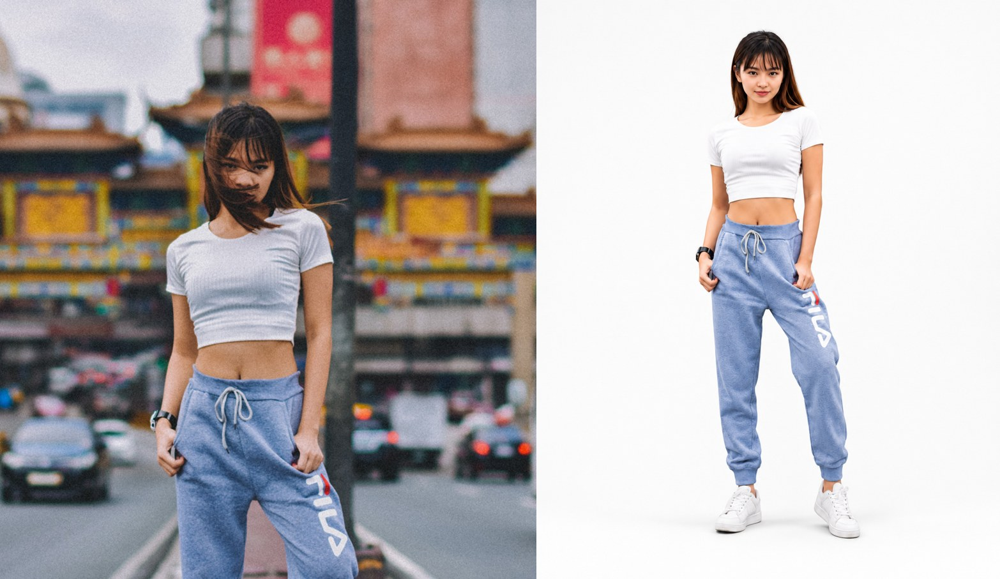
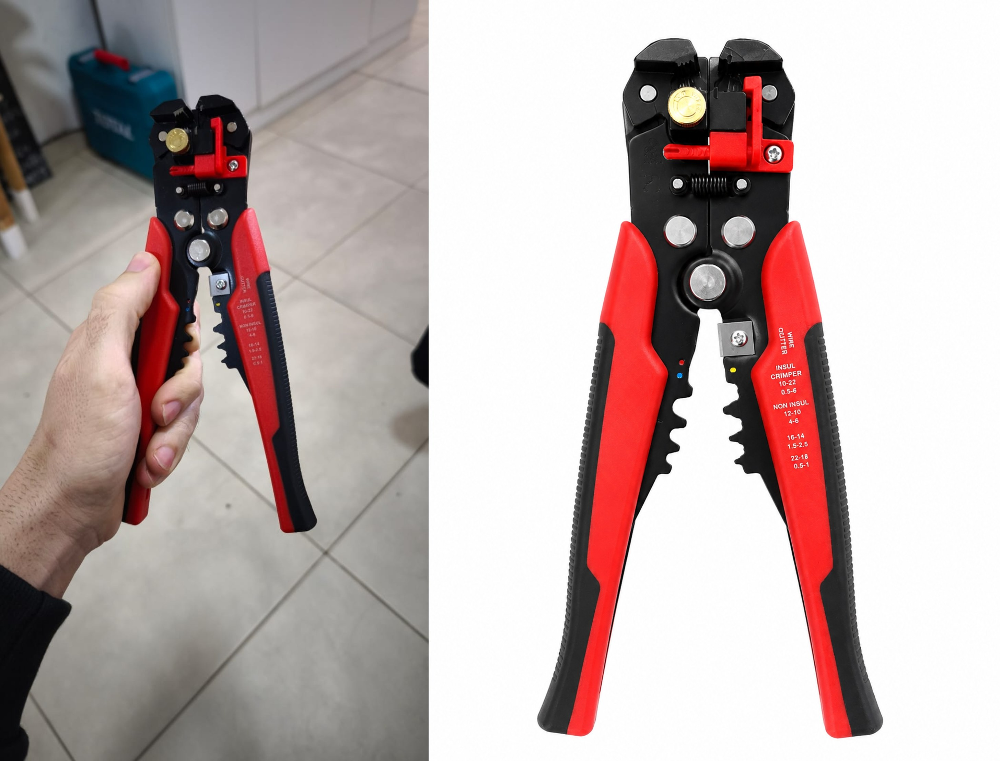

# ecommerce-catalog-images

Un conjunto de instrucciones, templates de prompts y scripts de Python para generar imágenes de catálogo de e-commerce en tres modos. Nació como una Skill de Claude (una carpeta con instrucciones, scripts y archivos de referencia), pero el contenido en sí —las reglas, los templates de prompts y los scripts— **no depende de ningún LLM en particular**. Se puede usar tal cual en Claude, adaptarlo a un GPT personalizado en ChatGPT, describirle directamente la edición a Nano Banana (el modelo de imágenes de Gemini), pegarlo como instrucciones en cualquier otro asistente, o directamente ejecutar los scripts de Python a mano, sin ningún LLM de por medio.

---

## Qué hace

Según el pedido, se aplica uno de tres modos:

| Modo | Qué produce | Cuándo se usa |
|------|-------------|---------------|
| **1 — Crear desde cero** | **Prompts de texto** optimizados para ChatGPT/DALL-E, Gemini/Imagen y Midjourney, a partir de la descripción de un producto | Cuando no hay imágenes para subir, solo una descripción del producto |
| **2 — Combinar imágenes** | Un archivo `.png` real, generado con Python + Pillow | Cuando hay 2 imágenes (logo + producto, variantes de color, side-by-side, grilla de SKUs, escena lifestyle) |
| **3 — Mejorar foto real** | Un archivo `.png` real, con el fondo eliminado y recompuesto según specs de plataforma, generado con rembg + Pillow | Cuando hay 1 foto real de producto y se pide fondo blanco / Google Shopping / Mercado Libre |

Regla universal en los tres modos, aunque no se pida explícitamente: **sin logos, sin texto, sin marcas de agua, sin precios, sin overlays.**

### Ejemplo — Modo 1 (generación de prompts)

**Pedido:** "Necesito prompts para una zapatilla running blanca de mujer, estilo packshot, para Google Shopping, en ChatGPT y Midjourney."

**Resultado:** prompts listos para pegar en cada herramienta, por ejemplo:
```
Professional product photography of white women's running sneakers, leather and
mesh upper, chunky rubber sole, centered on a clean white background...
No text, no logos, no watermarks, no brand marks, no price tags, no people, no props.
High resolution, professional e-commerce catalog style.
```
más un nombre de archivo SEO sugerido: `zapatillas-running-blancas-mujer.png`

### Ejemplo — Modo 2 (combinar imágenes)

**Pedido:** dos imágenes (foto de producto + logo) + "Poné el logo centrado sobre el producto."

**Resultado:** un archivo real `producto_overlay-logo_catalog.png`, generado por `scripts/combine_images.py`.

### Ejemplo — Modo 3 (mejorar foto real)

**Pedido:** una foto real de producto + "Sacale el fondo y dejala lista para Mercado Libre."

**Resultado:** un archivo real `producto_catalog.png`, fondo eliminado y compuesto sobre un canvas blanco de 1200×1200px, generado por `scripts/remove_background.py`.

### Ejemplos visuales (antes / después — Modo 3)

Estos son dos casos reales generados con el script de eliminación de fondo (`scripts/remove_background.py`), foto original a la izquierda y resultado de catálogo a la derecha:

**Prenda deportiva** — foto callejera vs. packshot en fondo blanco:



**Herramienta (pelacables)** — foto de celular vs. producto listo para Mercado Libre / Google Shopping:



En ambos casos el script recorta el fondo, centra el producto y lo recompone sobre un canvas blanco al porcentaje de relleno definido por la plataforma elegida — sin tocar el producto en sí.

---

## Estructura del repositorio

```
ecommerce-catalog-images/
├── README.md
├── LICENSE
├── .gitignore
├── SKILL.md                              ← instrucciones principales (formato Skill de Claude)
├── streamlit-app/                         ← app sin código, en lote, sin LLM
│   ├── app.py
│   ├── requirements.txt
│   └── README.md
├── adaptations/                           ← versiones adaptadas a otras plataformas
│   └── chatgpt-instructions.md           ← listo para pegar en un GPT personalizado
├── examples/                              ← ejemplos visuales de antes/después
│   ├── modo3-prenda-deportiva-antes-despues.jpg
│   └── modo3-herramienta-pelacables-antes-despues.jpg
├── references/
│   ├── prompt-templates.md               ← templates para ChatGPT, Gemini, Midjourney
│   ├── platform-specs.md                 ← specs de Google Shopping, Mercado Libre, etc.
│   └── industry-vocabulary.md            ← vocabulario técnico por rubro
└── scripts/
    ├── requirements.txt
    ├── remove_background.py              ← rembg + Pillow (Modo 3)
    └── combine_images.py                 ← Pillow (Modo 2)
```

## Requisitos

- Python 3.11+ (lo requiere `rembg`)
- [Pillow](https://pypi.org/project/pillow/) — procesamiento de imágenes (Modos 2 y 3)
- [rembg](https://pypi.org/project/rembg/) — eliminación de fondo con IA (solo Modo 3)

Instalación:
```bash
pip install -r scripts/requirements.txt
```
En sandboxes de Claude.ai / Claude Code puede ser necesario el flag `--break-system-packages`:
```bash
pip install -r scripts/requirements.txt --break-system-packages
```

El Modo 1 no necesita ninguna dependencia: solo genera texto.

---

## 🆕 La forma más simple: app de Streamlit (sin código, sin LLM, en lote)

Si lo que necesitás es procesar varias fotos de producto de una sola vez —sin escribir prompts, sin configurar nada de IA— está [`streamlit-app/`](streamlit-app/): subís las fotos en lote, elegís la plataforma de un menú desplegable (Google Shopping, Mercado Libre, TiendaNube, Pinterest, Instagram u otra) y descargás todas las imágenes procesadas en un `.zip`. Corre 100% en Python (sin ningún LLM de por medio), no guarda las imágenes en ningún servidor, y se puede publicar gratis en Streamlit Community Cloud. Instrucciones completas en [`streamlit-app/README.md`](streamlit-app/README.md).

Las opciones siguientes (a–d) son para quien quiera usar el contenido de otra forma: integrado a un asistente conversacional, en Claude Code, o de forma totalmente manual.

## Cómo usarlo

Hay cuatro formas de aprovechar este repositorio, según qué herramienta tengas a mano.

### a) ChatGPT o Nano Banana (Gemini), según tu preferencia

**Si preferís ChatGPT** (GPT personalizado o Proyecto):

1. Crear un **GPT personalizado** (o un Proyecto) en ChatGPT.
2. Pegar el contenido de `adaptations/chatgpt-instructions.md` en el campo de **instrucciones** del GPT — es una versión de `SKILL.md` adaptada y recortada para este entorno (sin el YAML de disparo automático de Claude, sin referencias a herramientas que solo tiene Claude, y dentro del límite de caracteres del campo de instrucciones).
3. Subir `references/prompt-templates.md`, `references/platform-specs.md` y `references/industry-vocabulary.md` como archivos de **conocimiento** (Knowledge) del GPT.
4. Para los Modos 2 y 3, subir también `scripts/combine_images.py` y `scripts/remove_background.py`, y activar **Code Interpreter & Data Analysis** en las capacidades del GPT para que pueda ejecutarlos sobre las imágenes que subas en la conversación.

> ⚠️ El entorno de Code Interpreter de ChatGPT no siempre tiene acceso a internet, y `rembg` necesita descargar un modelo la primera vez que se usa. Si el Modo 3 falla por falta de conexión, corré el script en tu propia máquina (ver opción c) y subí el resultado a la conversación.

**Si preferís Nano Banana** (el modelo de generación y edición de imágenes de Gemini — app de Gemini, Google AI Studio o API):

Nano Banana edita imágenes de forma conversacional y nativa, así que para los Modos 2 y 3 no hace falta correr ningún script: alcanza con subir la imagen y describirle el resultado que buscás, usando como referencia las specs de `references/platform-specs.md`. Por ejemplo:

> "Quitale el fondo a esta foto, centrala sobre un fondo blanco puro de 1200×1200px ocupando el 85% del frame, sin agregar logos ni texto."

Para combinar imágenes (Modo 2), subí ambas imágenes y describí el tipo de combinación (logo centrado, side-by-side, grilla de SKUs, escena lifestyle) tomando como guía la tabla de la sección 4 de `SKILL.md`. Para el Modo 1, los templates de la sección "Gemini / Imagen" en `references/prompt-templates.md` funcionan directamente con Nano Banana.

### b) Como Skill nativa en Claude.ai (Projects)

1. Verificar que **Code execution and file creation** y **Skills** estén habilitados (Settings → Capabilities; en planes Team/Enterprise lo habilita un owner en Organization settings → Skills).
2. Descargar este repositorio como ZIP (el ZIP debe contener la carpeta `ecommerce-catalog-images` en su raíz, no los archivos sueltos).
3. Ir a **Customize → Skills → "+" → "Create skill"** y subir el ZIP.
4. Activar la skill con el toggle.
5. Probarla con un pedido como "Generame prompts para una imagen de catálogo de [producto]".

### c) Uso manual, sin ningún LLM

Los scripts de los Modos 2 y 3 son herramientas de línea de comandos independientes: no necesitan ningún LLM para funcionar. Cualquiera con Python instalado puede usarlos directamente:

```bash
pip install -r scripts/requirements.txt

python3 scripts/remove_background.py --input foto.jpg --platform mercado_libre --output catalogo.png

python3 scripts/combine_images.py --image-a producto.png --image-b logo.png --mode overlay-logo --output resultado.png
```

Y los templates de `references/prompt-templates.md` se pueden copiar y pegar a mano en cualquier herramienta de generación de imágenes (ChatGPT/DALL-E, Gemini, Midjourney), sin que ningún LLM orqueste el proceso.

### d) En Claude Code

Instalación personal (disponible en todos los proyectos):
```bash
git clone https://github.com/<tu-usuario>/ecommerce-catalog-images.git ~/.claude/skills/ecommerce-catalog-images
```

Instalación por proyecto (se versiona junto con el repo):
```bash
git clone https://github.com/<tu-usuario>/ecommerce-catalog-images.git .claude/skills/ecommerce-catalog-images
```

La carpeta de la skill debe quedar directamente dentro de `.claude/skills/` o `~/.claude/skills/`, sin un nivel extra de anidamiento. Iniciá (o reiniciá) una sesión de Claude Code y corré `/skills` para confirmar que cargó.

---

## Contribuir

Se aceptan issues y pull requests: nuevas specs de plataformas, vocabulario de más rubros, nuevos modos de combinación para `combine_images.py`, o fixes a cualquiera de los dos scripts.

1. Hacer un fork del repo
2. Crear una rama (`git checkout -b feature/mi-mejora`)
3. Commitear los cambios
4. Abrir un pull request explicando qué cambia y por qué

Si `SKILL.md` crece, conviene mover contenido nuevo a `references/` en vez de extenderlo — mantenerlo por debajo de ~500 líneas ayuda a que cargue rápido como contexto.

## Licencia

MIT — ver [LICENSE](LICENSE). Libre para usar, modificar y redistribuir.
